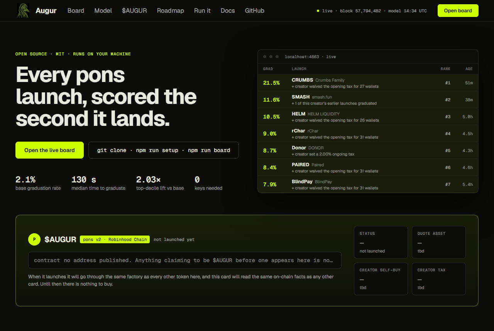
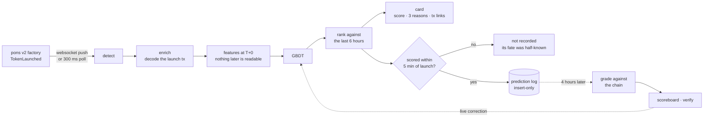
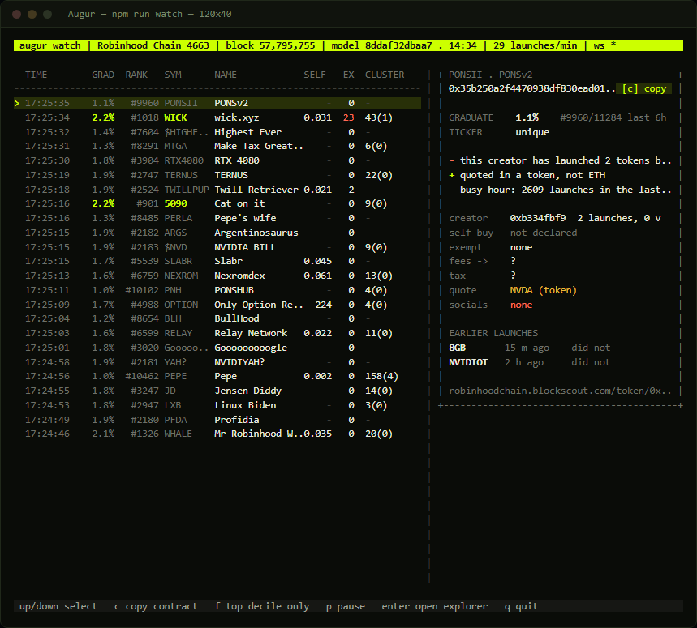
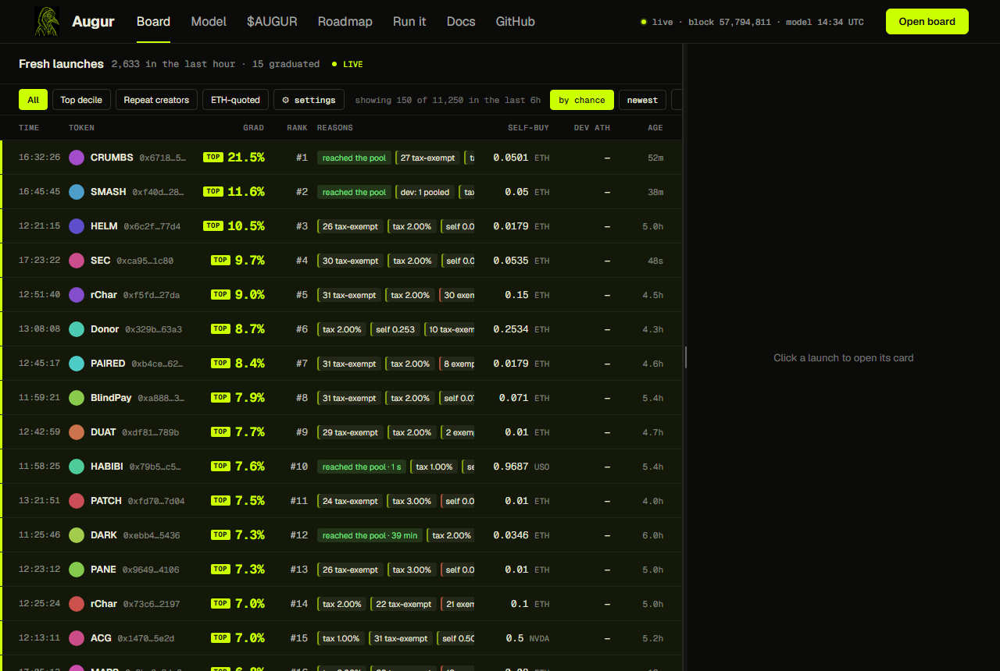
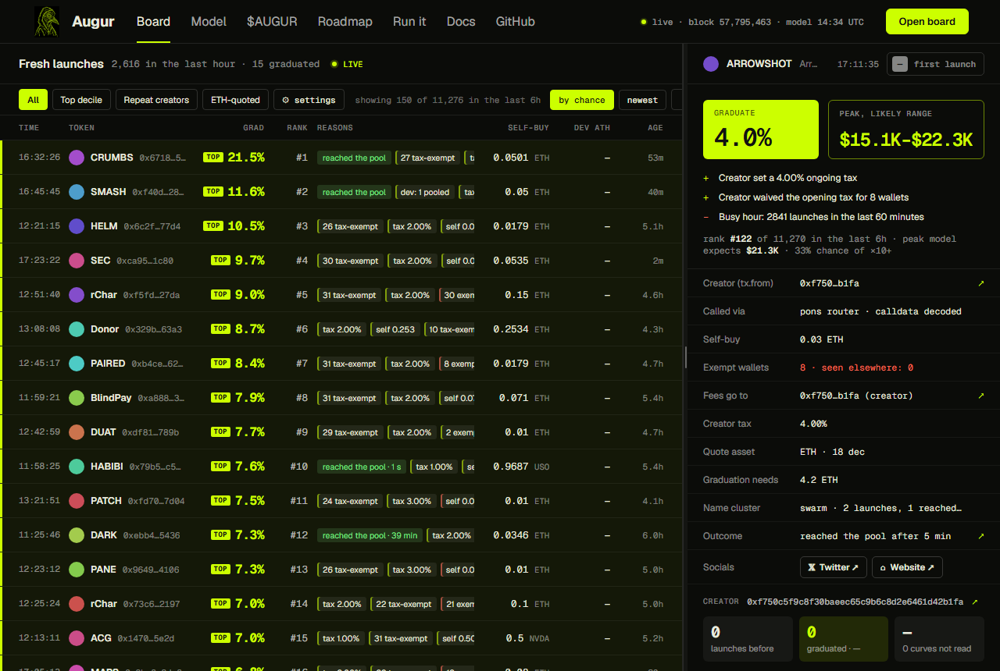
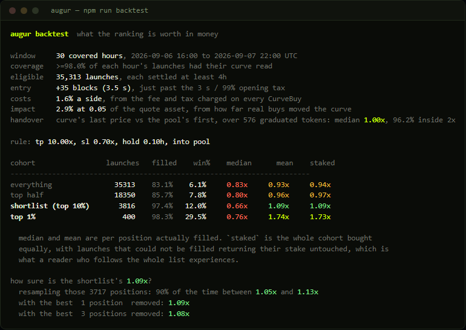
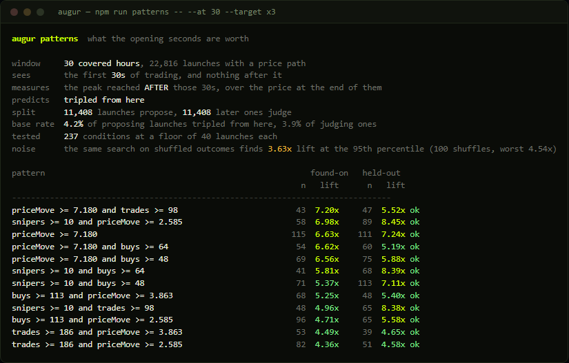
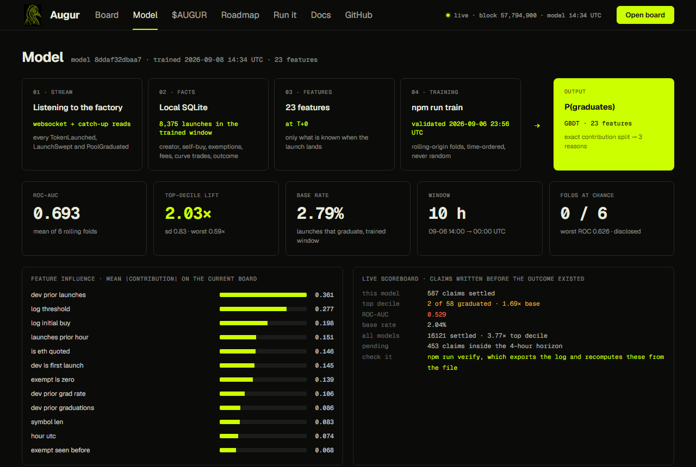

<div align="center">


# Augur

**a prediction engine for pons v2 launches on Robinhood Chain**<br>
two models · 23 leak-free features · every call logged before its outcome exists<br>
local · open · no wallet · no key · nothing leaves your machine

<br>


<br>


<br>

<!-- $AUGUR: when the token launches, replace `not launched yet` with the contract address.
     This line and the "The token" section near the bottom are the only two places to change. -->
**$AUGUR** · `not launched yet`

<sub>No address has been published. Anything claiming to be $AUGUR before one appears here is not ours.</sub>

<br>

<sub>by <a href="https://x.com/kingwilliam_">@kingwilliam_</a></sub>

</div>

<br>

**24,000 tokens a day** launch on [pons](https://www.ponsfamily.com). **Two in a hundred** reach a
Uniswap pool, and half of those decide inside **two minutes**. No one reads that stream. Almost
nobody has ever measured it.

Augur is a quantitative research stack pointed at it. As each launch transaction lands it is
decoded, turned into a 23-dimensional feature vector built strictly from what is knowable at that
instant, and put through two gradient-boosted models: one for the **probability it reaches the
pool**, one for **how high it climbs** if it does. The result is a rank against every other launch
of the last six hours, and three plain sentences saying which features moved it.

Then the part almost nothing in this category does. Every score is **written down before the outcome
exists**, graded four hours later against the chain, and fed back as a live calibration. The record
is a file you can export and recompute without trusting a line of this code.

| | |
|---|---|
| **Detection** | websocket push off the pons v2 factory, 300 ms polling as fallback, gap-recovering catch-up reads |
| **Features** | 23, computed strictly at T+0. Nothing reads a trade, a price, or an outcome |
| **Models** | gradient-boosted trees, written out rather than imported, so contributions decompose exactly into the reasons shown |
| **Validation** | rolling-origin folds, time-ordered, never a random split |
| **Prediction log** | insert-only, pre-registered, refuses any launch older than five minutes |
| **Backtest** | replayed against the price paths that actually happened, costs measured off the chain |
| **Pattern mining** | candidate search raced against a permutation null, so a finding has to beat what the search invents from noise |
| **Runtime** | one dependency, one file of SQLite, no key, nothing leaves the machine |

<br>



<br>

| What you would otherwise do by hand | What Augur does instead | Command |
|---|---|---|
| 24,000 launches a day, 530 graduate | scores every one at the moment it lands and ranks it against the last six hours | `board` · `watch` |
| a bare "4%" means nothing | gives you `#3 of 412` instead, and the rank is the part you can act on | `board` |
| "why this one?" | three plain sentences per launch, each linked to the transaction it came from | `board` |
| "is the tool any good, or is it telling me a story?" | every score is written down **before** the outcome exists, then graded against the chain | `scoreboard` · `verify` |
| "does following it make money, or just rank well?" | replays the ranking against the price paths that actually happened | `backtest` |
| "is there a shape that runs?" | searches the opening seconds, then attacks what it finds three ways | `patterns` |
| `deployer` is not the creator | reads `tx.from`; Multicall3 is the single largest "deployer" in a day | `board` |
| half of launches aren't quoted in ETH | resolves each quote asset's decimals so amounts aren't printed as `0.0000` | everywhere |

<br>

## How it works

The left half is inference: chain to feature vector to model to a rank you can act on. The right half
is what turns a claim into a record, and it is the half nothing else in this category has: the score
is written down before the outcome exists, graded later against the chain, and fed back as a live
calibration on the model that produced it.



## What you actually see



**`#1018 of 11,284`** is the useful half. On its own WICK's "2.2%" means little; "a thousandth best
of the last six hours" tells you whether to look now or never, and the red `23` beside it is
twenty-three wallets the creator waived the opening tax for. Every launch on that screen was scored
the second it landed and written to the prediction log before anyone knew how it ended.

Or the same feed on a local page, which is the same engine behind `npm run board`:



Click any launch and the card holds everything known about it: who really created it, how much they
bought themselves, which wallets they let in before the 99% opening tax, where the creator fees are
routed, how many times this exact ticker has launched before and how those ended.



Every line links to the transaction it came from, so you can check any of it without trusting this
tool. `Outcome · reached the pool after 3 min` is read back off the chain, not from anything Augur
decided.

<br>

## Does it work?

Three different questions, three different answers, and only one of them is about money.

### 1. Do the predictions carry information? Yes

Call the top tenth of the ranking the **shortlist**.

> Out of a hundred launches picked at random, about **two** reach the pool.
> Out of a hundred taken from the shortlist, about **eight** do.

Roughly **3.7x better than guessing**, across a full week of 164,700 launches and 3,480 graduations,
tested the hard way: the model is only ever scored on launches that happened *after* the ones it
learned from. Six sequential test periods, every one better than chance, ROC-AUC 0.734 to 0.795.

### 2. Does following it make money? A little, and not the way you would hope

Ranking well and paying well are different questions, and a model can win the first and lose the
second. `npm run backtest` replays the board against the price paths that actually happened: buy at
+3.5 s (just past the opening tax), sell on a 10x target, a 30% stop, or six minutes, whichever comes
first.



Nothing in that header is an assumption. Costs come off the `fee` and `tax` fields of every CurveBuy;
slippage comes from how far real buys moved the curve; and the `handover` line is a unit test that
runs on live data. A token hands over from its curve to its pool at one price, so the two readings
of it should divide to 1.00, and they do.

| cohort | launches | win rate | median | mean |
|---|---|---|---|---|
| everything | 35,313 | 6.1% | 0.83x | **0.93x** |
| top half | 18,350 | 7.8% | 0.80x | **0.96x** |
| shortlist (top 10%) | 3,816 | 12.0% | 0.66x | **1.09x** |
| top 1% | 400 | 29.5% | 0.76x | **1.74x** |

Read that carefully, because the honest parts are the ones that don't fit on a poster:

- **The predictions are the whole product.** Buying everything returns 0.93x. Buying the shortlist
  returns 1.09x, and the top percentile 1.74x, where three launches in ten win. That gap is what the
  models are worth.
- **You still lose on 88% of positions.** The median one is 0.66x. The return lives in a tail, and if
  that ratio does not fit how you trade, nothing here fixes it.
- **Resampling the 3,717 shortlist positions puts the mean between 1.05x and 1.13x nine times out of
  ten.** Remove the ten best and it is still 1.07x, so it is not one lucky token. It is still an edge
  measured over thirty hours, not a week.
- **This number moves, and you should watch it move.** The first run of this backtest, on fourteen
  hours and an older model, read 1.12x and lost all of it when the ten best positions were removed.
  Since then the sample has more than doubled and the models have been refit three times; the
  shortlist has read 1.07x, 1.17x and 1.09x across those runs while its robustness improved every
  time. The level is noisy, the direction is not, and neither is a promise. The reason to trust
  anything here is not this paragraph, it is that `npm run backtest` recomputes it on your own data
  in six seconds.
- **Speed past the tax window buys little.** Entering at +3.5 s returns 1.09x; at +60 s, 1.06x. The
  whole minute is worth about three percent, so being 200 ms faster than the next person is worth
  nothing measurable. The opening tax has already eaten that race, which is why this predicts rather
  than races.

### 3. Is there a green flag in the opening seconds? Yes, and it is costly signalling

`npm run patterns` searches the first 30 seconds of trading for shapes that precede a run. A search
that wide will *always* find something, so every candidate is attacked three ways: proposed on older
launches and judged on newer ones, floored at 40 launches of support, and raced against **the same
search run on shuffled outcomes**, which is what the search invents from nothing.



The noise line sits at 3.63x lift. What clears it, on the half that did not propose it:

| pattern (first 30 s) | held-out | n |
|---|---|---|
| `snipers ≥ 10` and `priceMove ≥ 2.59` | **8.45x** | 89 |
| `snipers ≥ 10` and `buys ≥ 64` | **8.39x** | 68 |
| `priceMove ≥ 7.18` | **7.24x** | 111 |

The `--` row in that screenshot is the point of the whole exercise: a pattern that scored 4.52x
where it was found and 1.61x where it was tested is not a finding, and the tool says so rather than
printing the first number and stopping.

`snipers` is the number of wallets that **paid the 99% opening tax** to get in during the first three
seconds. Ten of them is ten wallets each burning almost their whole entry for the privilege, which
is the most expensive vote of confidence this chain allows anyone to cast. Against a base rate of 3.9%
tripling from the 30-second price, those launches triple about a third of the time.

None of this is in the score today. It is measured, not shipped.

<br>

## Install

Node 22.6 or newer. No Python, no build step, no database to install. One runtime dependency.

```bash
git clone https://github.com/kingwilliamAI/Augur.git augur && cd augur
npm install
cp .env.example .env
npm run doctor
```

`doctor` checks it can reach the chain and that pons has not moved its contracts. If it fails, stop
there; nothing else will work.

| | |
|---|---|
| **Required** | Node ≥ 22.6 |
| **Runtime dependencies** | `viem`. That is the list. |
| **Key** | none, for anything. There is no command that signs. |
| **Detection** | publicnode's websocket for pushes; `RPC_WS_URL=off` falls back to 300 ms polling |
| **Public RPCs** | two on purpose: only the official one serves `eth_getLogs`, only publicnode has a socket. Raise `RPC_IN_FLIGHT` if you bring your own provider. |
| **Storage** | `node:sqlite`, shipped with Node. One file under `data/`. |

<br>

## Sixty seconds

```bash
npm run doctor      # is the chain there, and are pons's addresses what we think
npm run setup       # a week of launches, and the last eight hours decoded (~13 min)
npm run board       # the list, at http://localhost:4663
npm run scoreboard  # how its past calls actually turned out
```

A trained model ships with the repository, so there is nothing to fit before you can look. Two things
worth doing once it is running:

```bash
npm run enrich-window -- --hours 168   # decode the rest of the week (~40 min)
npm run train                          # refit on your own data rather than the shipped model
```

<br>

## Commands

Nothing here needs a key, because nothing here signs.

| Command | What it does |
|---|---|
| `doctor` | endpoints, chain id, contract addresses against the factory's own getters |
| `board` | the list on a local web page, `http://localhost:4663` |
| `watch` | the same feed in a terminal, logging each score it prints |
| `scoreboard` | the live record, by model era |
| `verify` | dumps the prediction log to JSONL and recomputes the numbers from the file alone |
| `stats` | what is in the database |
| `backtest` | what following the ranking would have returned, with costs measured from the trades |
| `patterns` | searches the opening seconds for shapes, against a permutation null |
| `early` | whether those shapes improve the peak model, on rolling-origin folds |
| `setup` | everything a fresh clone needs |
| `backfill` | factory events: who launched, when, and what graduated |
| `enrich-window` | decodes launch transactions across a contiguous span |
| `curves` | reads curve trades in bulk, so peaks exist for more than what somebody clicked |
| `train` · `validate` | fit and print held-out metrics · rolling-origin folds |
| `nightly` | backfill, enrich, retrain, in that order |
| `telegram` | optional bot, the only part of this project that talks to a third party |

<br>

## Where it lets you down

- **You are wrong most of the time even when you follow it.** Ninety-two launches in a hundred on the
  shortlist never reach the pool, and 87% of positions lose money. Eight in a hundred beats two in a
  hundred and is still mostly failure.
- **It has not lived through a regime change.** Launch tactics drift, and a scanner that works this
  month can quietly stop working next month. The live scoreboard is what will tell you. Watch that,
  not the numbers in this file.
- **The money section is thirty hours, not a week.** Curve trades are read on demand, so only hours
  where nearly every launch was read can be tested at all. `npm run curves` widens that.
- **It knows nothing about anything except pons v2 launches.** Not price, not safety, not whether a
  token is a scam. It answers one question and has no opinion on any other.
- **A public score invites gaming.** If enough people trade off the same signal, the signal changes.

<br>

## The token

**$AUGUR** · `not launched yet`

There is no contract address yet, and this file is where one will appear. Anything claiming to be
$AUGUR before an address is published here is not ours.

When it does launch it will go through the same factory as every other token on pons, and its card
on the board will read the same on-chain facts as any other card: what the creator bought, which
wallets were exempted from the opening tax, where the fees are routed. It gets no special treatment
from the scanner, and the scanner has no opinion about it. Until then there is nothing to buy.

The scanner does not need the token to work. It holds no key, has never needed one, and nothing in
this repository changes when an address exists.

<br>

## Can I check any of this?

You can, and you should not trust it otherwise.

Augur writes down every score at the moment it gives it, **before the outcome exists**. Four hours
later it looks up what happened and grades itself. Two rules keep that log honest:

- **A launch older than five minutes is never recorded.** Half of graduations are decided by then, so
  scoring late would flatter the record with launches whose fate was already half-known.
- **A score cannot be edited afterwards.** The first thing Augur says about a launch is the thing it
  gets graded on.

```bash
npm run scoreboard   # the record on your own machine, which is the only one worth anything to you
npm run verify       # export the log, recompute from the file, hand it to someone who trusts nothing
```

The board shows the same thing, including the folds that landed at chance:



Every row names a token, the exact moment the score was written, and what happened. All three are on
chain. You can verify any of it in a block explorer without this tool.

<br>

---

<br>

# Under the hood

Everything below is for reading or changing the code. You do not need any of it to use the tool.

## The pipeline

```
factory logs  ──▶  SQLite  ──▶  features at T+0  ──▶  GBDT  ──▶  score + rank + reasons
   (live)          (local)       (leak-free)                          card (facts + tx links)
```

- **Ingest** (`src/ingest.ts`, `src/live.ts`) follows the pons v2 factory. The official RPC has no
  websocket, so a publicnode socket carries detection while the official endpoint serves the log
  reads. Every path funnels through the same catch-up read, so a dropped socket, a missed
  notification or a restart all recover by pulling the gap.
- **Storage** (`src/db.ts`) is `node:sqlite`, so there is no native module to build. Amounts are stored
  exact integers as strings, and floats for sorting.
- **Features** (`src/features.ts`) are computed strictly from what is knowable when the launch
  transaction lands. Nothing reads a trade, a price, or an outcome.
- **Model** (`src/model/gbdt.ts`) is gradient-boosted trees written out rather than pulled in, so the
  whole tool stays one runtime. Contributions decompose exactly, which is where the reasons come from.
- **Prediction log** (`src/track.ts`) records each live score before its outcome exists and grades it
  against the same label the model is trained on.
- **Backtest** (`src/backtest.ts`) prices positions only at levels the token actually traded at, and
  only on hours where nearly every launch was read.

## Four things that are easy to get wrong

Each of these silently produces a plausible, wrong answer.

1. **The docs list a stale factory.** `docs.ponsfamily.com` defaults to its v1 page, and the v1
   factory has been idle for weeks. v1 has no curve and no migration, and its graduation rate is
   indistinguishable from zero. `doctor` re-checks the addresses against the live factory's getters.
2. **`deployer` is not the creator.** `TokenLaunched` reports whoever called the factory, which is
   often a batching contract, and Multicall3 alone is the largest "deployer" in a day. The human is the
   transaction sender, which is why the card reads `tx.from`.
3. **Roughly half of launches are not quoted in ETH**, and those quote assets are tokenised stocks
   and a 6-decimal stablecoin. Formatting their amounts as 18-decimal wei prints `0.0000` for real
   values, so decimals are resolved and cached (`src/quote.ts`). The same trap bit the backtest: a
   curve price is raw-over-raw and a pool price is whole-over-whole, and one position came back at
   4,051,207,400x before the two were put on the same scale.
4. **About half of launches do not go through the pons router**, so their calldata cannot be decoded
   and the creator's declared terms are unknown. Folding that into "bought nothing" would poison the
   strongest signal, so absence is its own feature.

## How the evaluation avoids lying to itself

- **Splits are by time, never at random.** Launch tactics drift day to day, so a random split lets
  the model see the same hour it is tested on.
- **Creator history accumulates by graduation time, not launch time.** A creator's earlier launch can
  graduate *after* the launch being scored; counting it by the earlier launch's own timestamp would
  read the future.
- **Unsettled launches are dropped.** A launch from ten minutes ago has not graduated *yet*, which is
  not the same as not graduating.
- **Average precision is the headline, not ROC-AUC.** At a 2.2% positive rate, ROC-AUC flatters a
  model that is useless at the top of the ranking, and the top is the only part anyone looks at.
- **A target may never contain the evidence.** The pattern search first reported that launches
  already up 3.8x in their opening seconds tend to reach 5x. True, circular and worthless, because
  the lifetime peak contains the window the feature was measured in. It now scores against the peak
  reached *after* the window, which is the multiple a buyer could still capture.
- **A wide search is raced against itself on shuffled data.** The best of three hundred noisy
  estimates is not a typical noisy estimate, so `patterns` reports what the same search finds when
  there is nothing to find, and a candidate has to beat that rather than the base rate.

## Why `enrich-window` and not `enrich`

Training needs an *unbiased* sample. Enriching "all the graduated ones plus a scattering of others"
is fine for asking whether a feature separates the classes, but a model fitted on it is calibrated to
a positive rate that does not exist. `enrich-window` fills a contiguous span completely, and `train`
refuses to run on anything else. The backtest applies the same rule to curve reads, for the same
reason: a curve that was read *because somebody opened its card* is a launch selected by the very
score being measured.

## Retraining

```bash
npm run nightly
```

Labels settle quickly (the 4-hour horizon captures 98.5% of graduations), so a nightly retrain
always has fresh, fully resolved labels. `board` reloads the model per request, and `scoreboard`
starts a new era rather than pooling the new model's calls with the old one's.

## Tests

```bash
npm test
```

Deliberately narrow. They cover the places where a bug produces no error and no log line, just
quietly wrong output: block-timestamp interpolation, the booster itself, the prediction log's two
honesty rules, the backtest's lookahead and unit joins, and the pattern search's tautology trap.

## License

MIT.
